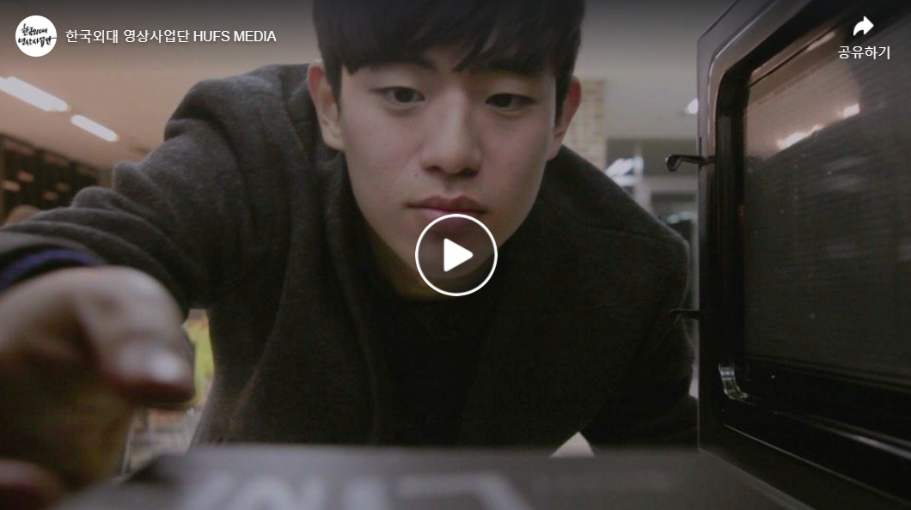

# About 

## - EDUCATION
- 2015.3 - 2020.8 한국외국어대학교 
  + 본전공: 이탈리아어학과
  + 이중전공: 국제통상학과

## - CERTIFICATIONS
- TOEIC 955
- OPic AL
- 국제무역사 1급
- 무역영어 1급
- Google Analytics Individual Qualification

## - EXTRACURRICULAR ACTIVITES
 | Date             	| 내용 	|
|------------------	|--------------	|
| 2016.03- 2017.12 	| 총학 산하 단체 영상사업단 HUFSMEDIA             	|
| 2018.02- 2018.07 	| UNIMI 밀라노 대학교 교환학생            	|
| 2018.03- 2018.08 	| 영삼성 글로벌리포터즈 1기            	|
| 2020.07- 2020.10 	| 아시아경제 빅데이터 산업융합 코스           	|

### [영상사업단 HUFSMEDIA]

 
#### 1.  [ 2016.12 과소개 영상](https://www.facebook.com/hufsmedia/videos/1089582977818370/) 
- 영상사업단 HUFSMEDIA의 가장 큰 프로젝트로 총학이 주최하는 새내기 새로배움터에 필요한 7개의 영상을 제작
- 그 중 대학의 34개의 과를 소개하는 과소개 영상을 맡아 기획 및 제작

 
#### 2.  [ 2016.10 요즘어때? 웹드라마](https://www.facebook.com/hufsmedia/videos/998109156965753/) 
- 페이스북 페이지를 홍보하려는 목표를 가지고 '요즘 어때?' 라는 웹드라마 시리즈 내에 옴니버스 형식으로 한 에피소드를 맡아서 기획 및 제작
- 기획, 시나리오 단계부터 촬영, 제작까지 하나부터 열까지 처음으로 제작했던 영상
- 1.1만회의 조회수 기록하며 가장 높은 조회수 기록 

 
#### 3.  [ 2016.12 과소개 영상](https://www.facebook.com/hufsmedia/videos/1214934621949871/) 
- 외국어대학교 특성상 각 과의 과방도 나라의 특색을 띄고 있습니다.
- 다른 과는 볼 수 없는 특색있는 과방을 찾아 뮤직비디오 처럼 '과방라이브' 프로젝트를 진행했습니다. 
- Wasn't Expecting That - Jamie Lawson

### [이탈리아 밀라노 교환학생]
 2018.2 - 2018.7 (6개월)

  + Italian language courses A2 (6credits)
  + Italian Culture for Foriegn Students (6credits) 
  + Organizational Behavior (9 credits)

### [영삼성 글로벌리포터즈]
밀라노 대표 글로벌리포터로 이탈리아 경제에 대한 기획 기사 작성

#### 1. Design Week 2018
- 밀라노 대표 전시회인 Design Week 삼성 리포터로 출연
- Design Week 에 밀라노 광장인 Duomo에 가게 수익이 얼마나 높아지는지에 대한 기획 기사로 우수 기자로 선정됨 
- [밀라노의 2월은 패션 위크, 4월은 OOO 위크?](https://www.youngsamsung.com/board/boardView.do?board_seq=70233) 

#### 2. 이탈리아의 와인
- 와인이 물보다 쌀 수 있는 이탈리아의 경제 분석
- [물보다 싼 이탈리아 와인?](https://www.youngsamsung.com/board/boardView.do?board_seq=70567) 

#### 3. Made in Italia 브랜딩
- Made in Italy 가 세계적으로 인정받을 수 있게 된 배경을 조사함
- 중소기업 위주로 산업 클러스터를 이루는 이탈리아 산업 분석
- [‘메이드 인 이탈리아’ 자체가 브랜드랍니다](https://www.youngsamsung.com/board/boardView.do?board_seq=70126) 

## - 공모전 참가 

#### 1. 초코에몽 대학생 UCC 콘테스트 [입선]
- 팀명: 불씨 
- 구성원: 이휘주, 김보경
- 출연: 이준호
- 기획: 대학생이 초코에몽이 필요할 때-  
매운 떡볶이 먹을 때, 친구에게 사과할 때, 시험공부하며 당 떨어졌을 때

- [초코에몽_불씨 영상 링크](https://youtu.be/Cj2C1djurBo) 

#### 2. 제일기획 아이디어 페스티벌 2020
- 팀명: 
- 구성원: 이휘주, 김보경, 김대희, 이지수

## - WORK EXPERIENCE
 | Date             	| 내용 	|
|------------------	|--------------	|
| 2018.09 - 2019.02	| SBS 디지털뉴스랩 스브스뉴스 인턴             	|
| 2019.03- 2020.06 	| (주)이노블스 실장 (아르바이트)            	|

### 1. 스브스뉴스 인턴

- 데일리 뉴스 조연출: 영상 제작에 필요한 장소, 출연자 섭외, 제목과 썸네일 제작 및 업로드 담당
- 브랜디드 콘텐츠 조연출: 브랜드사와의 협업을 하며 기획 및 촬영에 참여
- 플랫폼 인턴: 일주일에 한 번 플랫폼 분석을 통해 구독자 수 증감에 대한 이유와, 콘텐츠의 도달률을 높이기 위해 할 수 있도록 콘텐츠 형식 변경
- 뉴스와 커뮤니티 모니터링을 통해 트렌드를 조사하고, 아이템으로 만들 수 있는 트렌드 발제함

[데일리 콘텐츠]

1. [녹차 아이스크림 카페인 오지는 거 앎? (조연출, 내레이션)](https://www.youtube.com/watch?v=MHLeNO_ZsDc) 
2. [현지인도 몰라본 북유럽 감성? (조연출, 촬영 도움)](https://www.youtube.com/watch?v=LmDxJQILR_E)
3. ["차 사진 찍어드립니다" 고딩의 정체?! (조연출)](https://www.youtube.com/watch?v=0XOe3lnqD14)
4. [똑똑똑 추운데 문 좀 열어주세요~ (조연출, 촬영 보조)](https://www.youtube.com/watch?v=j2SSbF5o7Ak)
5. [기말고사 요약해드림ㅋㅋㅋㅋㅋㅋㅋ소름돋아;; (구성)](https://www.youtube.com/watch?v=eKYoTJBGUBk)
6. [외국인은 절대 이해 못하는 한국식 나이 (내레이션)](https://www.youtube.com/watch?v=XPyrJS4mA5w)
7. [시동생 이름 불렀다 '미쳤냐' 소리들은 썰 (도움)](https://www.youtube.com/watch?v=m-PzcBxu6HU)
8. [아몬드 대첩 #1. 한국인은 모르는 핫한 한국 특산품?! (조연출)](https://www.youtube.com/watch?v=Crk7cXNgqc4)
9. [아몬드 대첩#2. 아몬드 20가지 종류 맛 평가해 봄 (조연출)](https://www.youtube.com/watch?v=MrSuGZTZaKo)
10. [이게 조선의 갓이다! (feat. 킹덤) (도움, 자막, 번역)](https://www.youtube.com/watch?v=7uz6T-DRjQk)
11. [이젠 선인장에까지 낙서하냐? (조연출, 내레이션)](https://www.youtube.com/watch?v=mcHn4-8iVCk)

[브랜디드 콘텐츠]

1. [영화 1년 배우고 공모전 대상 받은 사연- SK브로드밴드 (조연출)](https://www.youtube.com/watch?v=UYw-lYfjh2o)
2. [제 직업은 '아가씨'가 아닙니다-보건복지부,대한간호협회 (조연출)](https://www.youtube.com/watch?v=8iEzbS3FcDs)
3. [엄마의 사랑이 만든 모두를 위한 옷- Ebay (조연출)](https://www.youtube.com/watch?v=6f7Zdr2oQk8)
4. [나의 혼밥 레벨은? -농립축산식품부 (출연)](https://www.youtube.com/watch?v=XJfL09Ivvmw)
5. [원하는 과목만 골라 듣는 고등학교? - 교육부 (조연출)](
https://www.youtube.com/watch?v=seL_FmBi-d8)
